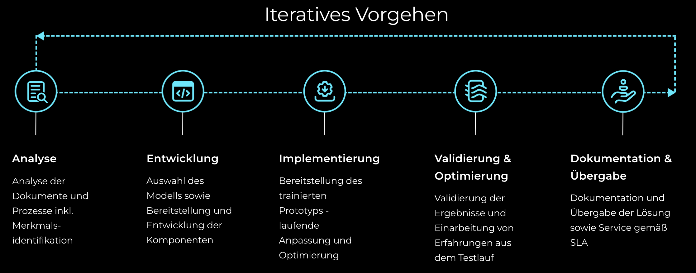
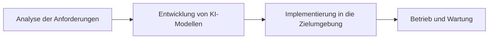
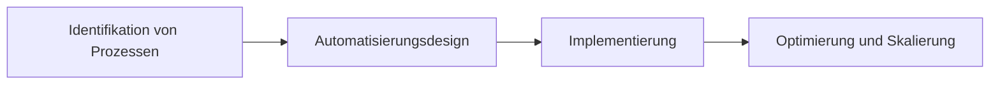
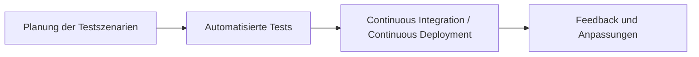
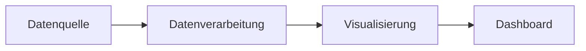
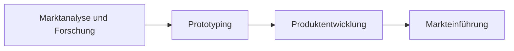

# Boiman Kupermann Solutions GmbH

## Willkommen bei Boiman Kupermann Solutions!

Innovativ, qualitativ und agil. Wir digitalisieren und automatisieren Geschäftsprozesse, um zukunftssichere Lösungen zu schaffen.

---

## Unsere Arbeitsweise

Bei Boiman Kupermann Solutions nutzen wir fortschrittliche Technologien und innovative Ansätze zur Optimierung und Automatisierung von Geschäftsprozessen.

### Unser Projektvorgehen

Wir implementieren Lösungen durch ein **iteratives Vorgehen**, das sich über mehrere Phasen erstreckt:

1. **Analyse**
   - Dokumenten- und Prozessanalyse inkl. Merkmalsidentifikation.
2. **Entwicklung**
   - Auswahl und Entwicklung der benötigten Modelle und Komponenten.
3. **Implementierung**
   - Bereitstellung und laufende Optimierung der trainierten Prototypen.
4. **Validierung & Optimierung**
   - Ergebnisvalidierung und Einbeziehung von Erfahrungen aus initialen Testläufen.
5. **Dokumentation & Übergabe**
   - Ausführliche Dokumentation und Übergabe der fertigen Lösungen.

### Leistungsschwerpunkte

#### 1. Künstliche Intelligenz

- **Beschreibung**: Nutzung fortschrittlicher KI-Technologien und erprobter Methoden zur Integration von Sprachmodellen in diverse Anwendungsgebiete.
- **Ziel**: Effiziente Automatisierung komplexer Aufgaben durch künstliche Intelligenz.

#### 2. Prozessautomatisierung

- **Beschreibung**: Automatisierung sämtlicher technisch umsetzbarer Prozesse zur Effizienzsteigerung und Kostenreduktion.
- **Ziel**: Transformation und Digitalisierung von Geschäftsprozessen zur Steigerung der operativen Effizienz.

#### 3. Qualitätssicherung

- **Beschreibung**: Sicherstellung der Softwarequalität durch kontinuierliche Integration und Deployment mittels CI/CD-Pipelines.
- **Ziel**: Hohe Produktqualität und schnelle Reaktionszeiten auf Änderungen sicherstellen.

#### 4. Visualisierung & Dashboarding

- **Beschreibung**: Entwicklung übersichtlicher Dashboards zur klaren Darstellung von Ergebnissen und Leistungskennzahlen.
- **Ziel**: Verbesserte Entscheidungsfindung durch transparente und intuitive Datenvisualisierung.

#### 5. Produktentwicklung

- **Beschreibung**: Von der initialen Idee über Prototyping bis hin zur vollständigen Entwicklung und Markteinführung.
- **Ziel**: Schnelle Realisierung innovativer Produktideen von der Konzeption bis zur Kommerzialisierung.

## Warum Boiman Kupermann Solutions?

Unser Ziel ist es, durch innovative Lösungen und agile Methoden Ihre Geschäftsprozesse auf ein neues Level zu heben und Ihnen einen deutlichen Wettbewerbsvorteil zu verschaffen.

### Transparente Lösungen

Wir sorgen für maximale Transparenz in unseren Projekten durch klar strukturierte Dashboards, die den Fortschritt und die Ergebnisse jederzeit nachvollziehbar machen.

---

## Kontaktieren Sie uns

**Boiman Kupermann Solutions GmbH**

Email: [info@boiman-kupermann.com](mailto:info@boiman-kupermann.com)
