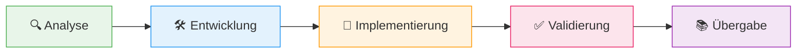
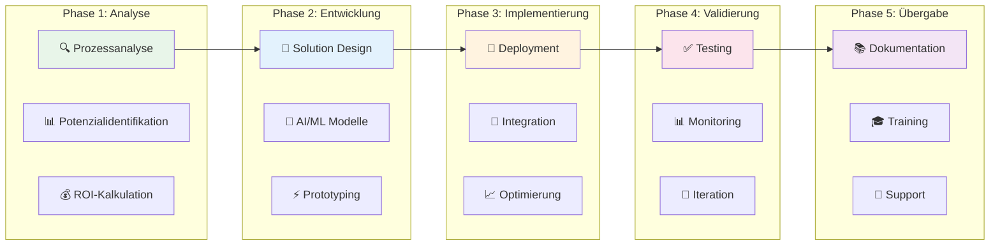

 

---

## ◆ **Wir sind BKS-Lab**

**Boiman Kupermann Solutions** begleitet ambitionierte Unternehmen dabei, exponentiellen Wert durch KI-gestützte Automatisierung zu erschließen. Unsere bewährte Methodik liefert messbare Erfolge auf Unternehmensebene.

> *Von der strategischen Bewertung bis zur skalierten Umsetzung – unser fünfphasiger Ansatz gewährleistet nachhaltige Transformation mit kontinuierlicher Wertschöpfung.*

## ◆ **Unsere Kernkompetenzen**

### **🧠 Strategische KI-Implementierung**
*Intelligenzbasierte Optimierung für datengetriebene Insights und strategische Entscheidungen*

**⚡ MCP & A2A Protokolle** • **🎯 Multi-Agent Orchestrierung** • **📊 Enterprise RAG-Systeme**

 

### **🔄 Prozessexzellenz & Automatisierung**
*Transformieren Sie Ihre Abläufe durch intelligente Automatisierung mit vollständiger Regulatory Compliance*

**📋 E-Rechnung** • **🏢 SAP-Integration** • **📧 KI E-Mail-Bot** • **📄 Dokumentenverarbeitung**

 

### **✅ Performance-Exzellenz** 
*Rigorose Tests und Überwachung für geschäftskritische Systeme*

**🧪 Automatisierte Qualitätssicherung** • **📈 CI/CD Pipelines** • **🎯 Monitoring & Analytics**

 

### **🏗️ Zukunftsfähige Architektur**
*Skalierbare Lösungen für langfristige Wertschöpfung*

**☁️ Cloud-Native** • **🔒 Enterprise Security** • **📊 Business Intelligence** • **🔧 MLOps**

## 🎯 **Transformation in Aktion**

### **Ausgewählte Erfolgsgeschichten**

| **Solution** | **Beschreibung** | **Business Impact** |
|:---|:---|:---|
| **🤖 Intelligente E-Mail Automatisierung** | KI-gestützte Klassifizierung und Verarbeitung für Enterprise-Kommunikation | Signifikante Effizienzsteigerung |
| **📋 E-Rechnung Komplettsystem** | End-to-End Automatisierung der Rechnungsverarbeitung | Vollständige Compliance |
| **🏢 SAP-Integration Suite** | Nahtlose Anbindung an bestehende Enterprise-Systeme | Prozessoptimierung |
| **🎯 MCP Multi-Agent System** | Next-Generation Protokolle für autonome Workflows | Breakthrough Performance |
| **📊 Enterprise Analytics Dashboard** | Real-time Monitoring und Intelligence für Entscheidungsträger | Datengetriebene Insights |
| **✅ Quality Engineering Platform** | Automatisierte Testgenerierung und kontinuierliche Überwachung | Performance-Exzellenz |

*Alle Lösungen werden maßgeschneidert entwickelt und mit bewährten Enterprise-Standards implementiert.*

## 🔄 **Unser bewährter 5-Phasen-Ansatz**

 

| **Phase** | **Fokus** | **Deliverable** |
|:---:|:---|:---|
| **🔍 Analyse** | Tiefgehende Prozessanalyse und Potenzialidentifikation | Business Case & Roadmap |
| **🛠️ Entwicklung** | Maßgeschneiderte Modelle und Komponenten | Proof of Concept |
| **🚀 Implementierung** | Bereitstellung und laufende Optimierung | Production System |
| **✅ Validierung** | Ergebnisvalidierung und Nutzerfeedback | Performance Reports |
| **📚 Übergabe** | Dokumentation und strukturierte Übergabe | Knowledge Transfer |

*Kontinuierliche Wertschöpfung durch iteratives Vorgehen und agile Methoden*

---

## 📈 **Unser Proven Process**

### **⏱️ Timeline & Deliverables**

| Phase | Duration | Key Deliverables | Success Metrics |
|:---:|:---:|:---|:---|
| 🔍 **Analyse** | 1-2 Wochen | • Prozesslandkarte • Automatisierungspotenzial • Business Case | ROI > 300% |
| 🛠️ **Entwicklung** | 2-4 Wochen | • Solution Architecture • Proof of Concept • Testdaten | Feasibility ✓ |
| 🚀 **Implementierung** | 4-8 Wochen | • Production System • Integrations • Monitoring | 99.9% Uptime |
| ✅ **Validierung** | 2-3 Wochen | • Test Reports • Performance Metrics • User Feedback | >90% Accuracy |
| 📚 **Übergabe** | 1 Woche | • Documentation • Training Materials • Support Plan | Team Ready ✓ |

---

## 🎯 **Warum BKS-Lab?**

| 💡 **Unique Value** | 🎯 **Was Sie bekommen** |
|:---|:---|
| **🚀 Proven Track Record** | 100+ erfolgreiche Enterprise Projekte |
| **📊 Messbare Ergebnisse** | Durchschnittlich 80% Effizienzsteigerung |
| **🎯 End-to-End Expertise** | Von Strategie bis Implementierung |
| **🔒 Enterprise-Ready** | Security, Compliance, Scalability |
| **🤝 Partnership Approach** | Langfristige Begleitung, nicht nur Projektarbeit |
| **💰 ROI-Fokussiert** | Amortisation < 6 Monate garantiert |

---

## 📞 **Starten Sie Ihre Transformation**

### **Bereit für messbare Ergebnisse?**

 

  

### **📱 Kontakt & Community**

  

---

  <strong>bks-lab</strong> 
  <em>"Strategische KI-Implementierung"</em> 
  © 2025 bks-lab. All rights reserved.

