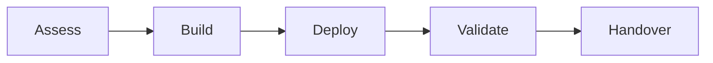
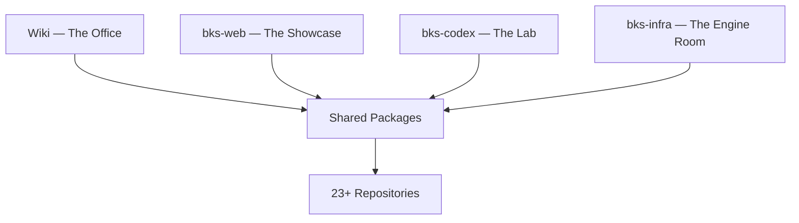

<div align="center">


[](https://git.io/typing-svg)

<br>

[](https://bks-lab.com)
[](mailto:info@boiman-kupermann.com)
[](https://linkedin.com/company/bks-lab)

</div>

---

## About BKS-Lab

**Boiman Kupermann Solutions** is a German AI consulting firm with 20+ years of engineering experience. We build production automation systems, run them in the cloud, and train teams to operate independently.

What sets us apart: **we run our own business on 49 custom AI skills.** From incident handling to invoice tracking, from news generation to meeting transcription — everything is AI-powered. When we build automation for clients, we're sharing what we use ourselves every day.

---

## What We Build

<div align="center">

### E-Invoicing & Peppol Compliance

Production operators processing invoices across the European Peppol network — inbound, outbound, and invoice validation for multi-country enterprises (DE, AT, BE, FR, LU).

`Peppol AS4` `UBL 2.1` `CII` `XRechnung` `Storecove` `EN 16931` `SAP ByD`

<br>

### Multi-Agent AI Systems

Autonomous agent networks for document classification, intelligent routing, and end-to-end workflow automation. Our [AI Labor](https://bks-lab.com/labor) demonstrates real-time agent orchestration with MCP and A2A protocols.

`MCP Protocol` `A2A Protocol` `Claude AI` `Azure OpenAI` `LiteLLM`

<br>

### Quality Engineering & Observability

Test automation with Playwright and browser-use, CI/CD pipelines, and full observability through the ELK Stack (Elasticsearch, Kibana) and Grafana. We set up the infrastructure that keeps production systems reliable and transparent.

`Playwright` `browser-use` `pytest` `GitHub Actions` `ELK Stack` `Grafana`

<br>

### Process Automation & Integration

End-to-end workflows connecting enterprise systems — email classification, SAP integration, document processing, and Microsoft Graph API automation.

`Azure Functions` `Azure Container Apps` `SAP` `Microsoft Graph` `Infrastructure as Code`

</div>

---

## AI-Native Operations

This is what makes BKS-Lab different. We don't just consult on AI — **we run our entire company on custom AI workflows.**

### 49 Custom Claude Code Skills

We've built a library of specialized AI skills that automate our daily operations:

<div align="center">

| Category | Skills | Examples |
|:---|:---:|:---|
| **Operations & Monitoring** | 7 | Log analysis, deployment verification, incident handling, post-deploy checks |
| **Customer & Communication** | 6 | Email management (MS Graph), SharePoint sync, Outlook processing, project notifications |
| **Development & Projects** | 5 | GitHub Projects automation, commit analysis, dashboards, sequential thinking |
| **Content & Documentation** | 7 | Multi-agent news generator, PDF export, certificates, meeting transcription, wiki analysis |
| **Cloud & Infrastructure** | 5 | Azure provisioning, blob storage portals, website deployment, backup automation |
| **Scheduling & AI Meta** | 4 | Recurring task scheduler, context orchestrator, Telegram bot, product vision builder |

</div>

### How It Works in Practice

```
Meeting recording drops into folder
  → AI transcribes and classifies meeting type
    → Structured protocol written to wiki
      → Action items extracted
        → GitHub issues created with correct project fields
          → Status notification sent via email
```

```
Stepstone reports an invoice error
  → Incident skill queries Elasticsearch logs
    → Correlation ID and root cause identified
      → Incident documented in wiki
        → GitHub issue created with all required fields
          → Go-live tracking updated automatically
```

### The BKS Cockpit

One command loads your entire project context — repo paths, open tasks, relevant documentation, active skills, and session state. No manual context-switching.

```bash
/cockpit load stepstone    # Loads everything for Stepstone project
/cockpit load docemos      # Switches to Docemos context
/dashboard --all           # All projects at a glance
```

---

## AI Training & Workshops

We teach what we practice. Our workshops are built from real experience operating AI-native workflows at scale.

<div align="center">

| Program | Format | Audience |
|:---|:---:|:---|
| **Claude Code Mastery** | 30 min - 2 days | Developers learning AI-assisted development, multi-agent workflows, custom skills |
| **AI Competency Training** | Half-day | Entire organizations building AI literacy and practical use cases |
| **AI for Leadership** | 2-3 hours | Executives evaluating strategic AI adoption and roadmap planning |
| **Business Development with AI** | Full-day | Product teams using Business Model Canvas for AI product ideation |

<br>

[](#)

All programs include **certification according to Article 4 of the EU AI Act** — delivered to 29+ professionals across engineering and technical documentation sectors.

</div>

---

## How We Deliver

<div align="center">


```mermaid
graph LR
    A["Assess"] --> B["Build"] --> C["Deploy"] --> D["Validate"] --> E["Handover"]
```

| Phase | What happens | Deliverable |
|:---:|:---|:---|
| **Assess** | Process analysis, data flow mapping, automation potential | Business case & roadmap |
| **Build** | Rapid prototyping with real data, iterative with your team | Working proof of concept |
| **Deploy** | Production on Azure with monitoring, alerting, CI/CD | Live system with SLA |
| **Validate** | Real workload testing, performance benchmarking | Verification reports |
| **Handover** | Documentation, team training, knowledge transfer | Self-sufficient operations |

</div>

---

## Tech Stack

<div align="center">

| Domain | Technologies |
|:---|:---|
| **Languages** | Python, TypeScript, Go |
| **AI & LLM** | Claude (Anthropic), Azure OpenAI, MCP Protocol, A2A Protocol, LiteLLM |
| **Cloud** | Azure Functions, Container Apps, Key Vault, App Insights, Blob Storage |
| **E-Invoicing** | Peppol Directory, SMP/SML, Storecove API, UBL/CII/XRechnung |
| **Web** | Astro, React, Tailwind CSS |
| **Data & Observability** | ELK Stack (Elasticsearch, Kibana), Grafana, PostgreSQL |
| **Quality** | Playwright, browser-use, pytest, GitHub Actions |
| **Infrastructure** | Terraform, Docker, SOPS, uv, Semantic Release |

</div>

---

## Our Ecosystem

<div align="center">


```mermaid
graph TD
    A["Wiki — The Office"] --> E["Shared Packages"]
    B["bks-web — The Showcase"] --> E
    C["bks-codex — The Lab"] --> E
    D["bks-infra — The Engine Room"] --> E
    E --> F["23+ Repositories"]
```

| Pillar | Purpose | Contains |
|:---|:---|:---|
| **Wiki** | Documentation & operations | Protocols, customer docs, processes, standards |
| **bks-web** | Public presence | Marketing website, blog, AI labor demos |
| **bks-codex** | AI tooling | 49 skills, MCP servers, commands, packages |
| **bks-infra** | Infrastructure | Terraform, secrets (SOPS+YubiKey), forensics, monitoring |

</div>

---

<div align="center">

### Explore our work

Open-source tools from our production work — check the pinned repos below.

<br>

<a href="https://bks-lab.com">
  
</a>
&nbsp;
<a href="https://bks-lab.com/labor">
  
</a>
&nbsp;
<a href="mailto:ai@bks-lab.com">
  
</a>

<br><br>

---


<sub>Based in Germany | Engineering-driven AI consulting since 2004 | &copy; 2026 BKS-Lab</sub>

</div>
